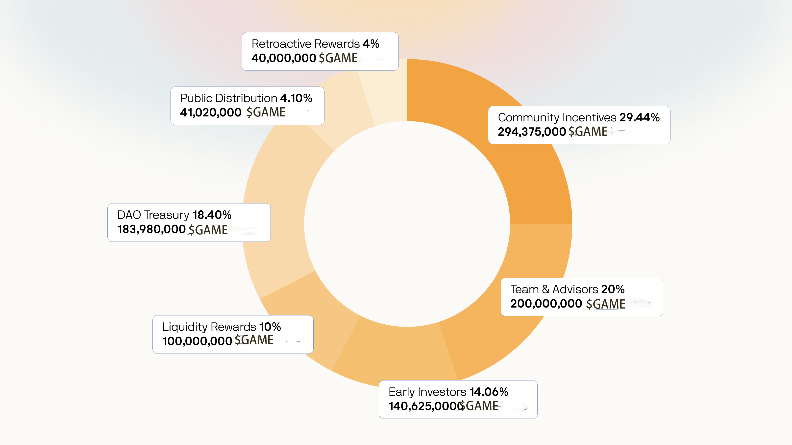

# Token distribution

The total supply will be 1,000,000,000 $GAME DAO tokens to be minted with no possibility for future inflation. The tokens will be distributed in the Token Generation Event (TGE) to the following stakeholders within the DAO:

* **Community Incentives** - through various means we want to reward our community for their efforts in contributing to our DAO's succes - 29.44% (294,375,000 GAME tokens)
* **Team & Advisors** - rewarding the core team members and advisors for their full-time effort to our DAO's succes 20% (200,000,000 GAME tokens)
* **DAO Treasury** - a position in the entire DAO's treasury will consist of GAME tokens - 18.40% (183,980,000 GAME tokens)
* **Early Investors** - the contributors that participated in our seed round - 14.06% (140,625,000 GAME tokens)
* **Liquidity Rewards** - incentives for providing liquidity on decentralized exchanges - 10% (100,000,000 GAME tokens)
* **Public distribution** - tokens set aside for the public round - 4.10% (41,020,000 GAME tokens)
* **Retroactive rewards** - reward for the earliest backers - 4% (40,000,000 GAME tokens)

