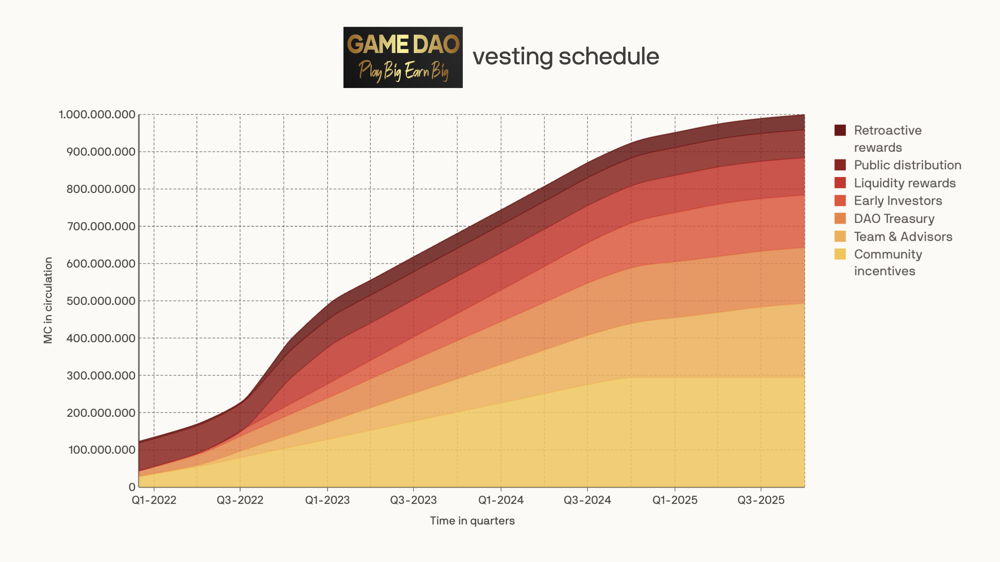

# Vesting

To align incentives of all stakeholders within the DAO, we included vesting for all categories except the public distribution - lockups per category can be find below:

* **Community Incentives** — No cliff period, 36 months vesting — tokens can only be allocated based on approved governance proposals
* **Team & Advisors** — 12 months cliff period followed by 42 months vesting
* **DAO Treasury** — No cliff period, 36 months vesting — tokens can only be allocated based on approved governance proposals
* **Early Investors** — 6 months cliff period followed by 36 months vesting
* **Liquidity Rewards** — 12 months cliff period after claiming (refer to information below)
* **Public Distribution** — No vesting
* **Retroactive Rewards** — 10% distribution after TGE, remaining part 18 months vesting

_**The initial circulating supply will be 79 million GAME based on the public distribution and 10% of the retroactive rewards. Community Incentives and DAO treasury will be partly unlocked but not brought in circulation since these funds will only be moved upon DAO’s approval.**_

